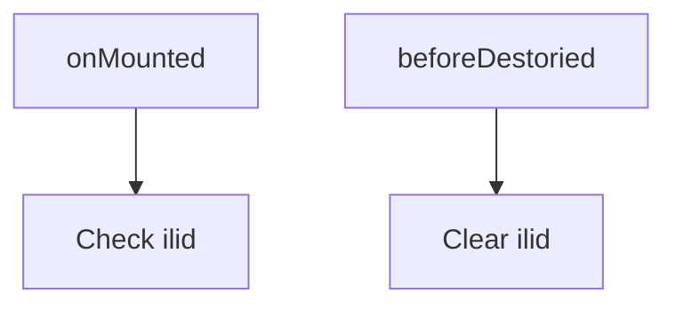

# Todos
- Reorganize folder strucutre

[Reference](https://raw.githubusercontent.com/aerobatic/markdown-content/master/docs/directory-structure.md)
```bash
├── workspaces
│   └── members
│       └── InvitationLink.vue (https://peristera.atlassian.net/browse/SGSR-328)
└─── 
```

### EditMember.vue

- Since ilid will only be used inside EditMember component, state will be managed by this component instead workspace. (2022 Nov 06). But it will be good to let workspace manage all the state of it's child components in future. 

