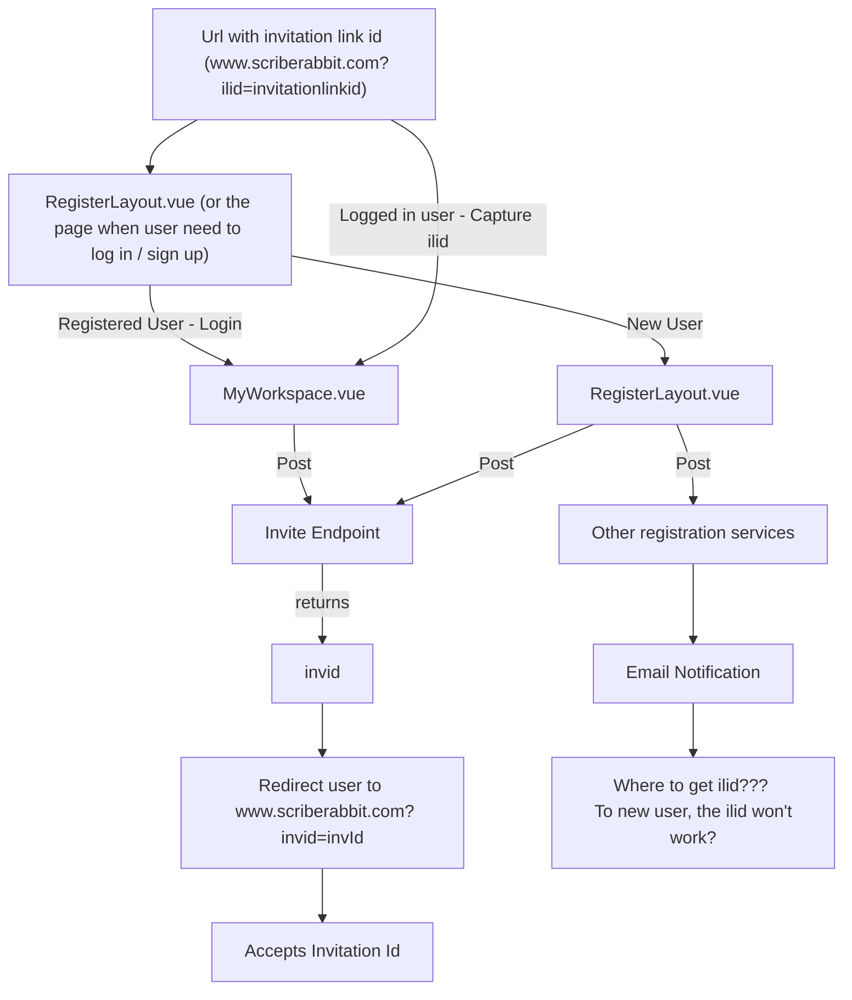

```text
I am looking at older invitation design.. we might need to redirect a few times..

Basically it will be something like
www.scriberabbit.com?ilid=invitationlinkid
Then frontend post request to  inviteendpoint/invitationlink/accept
then it returns you invId for the user after we create an invitation of user.
Which then we will need to redirect the user to www.scriberabbit.com?invid=invId
Then it accepts the invitation and the user is created
do you think this flow is okay?
the bottom half is what is already created. and i looked through frontend service for invitation and workspace. so far deletion of workspace user goes to invitation which then publish to workspace to remove user...
```

1. Send a link to user (param: ilid)
	<!-- `http://localhost:8080/#/workspaces?ilid=test-ilid` -->
	`http://localhost:8080/#/assumAdmin`
2. If user registered and loggedin, they will go to workspave page (currently param is not passed around)
	- If user not registered, or not logged in, the param will lost at the log in page (save it in local storage?)
3. Workspace page on load , read ilid (currently reading invid, add on ilid)
4. ilid does the same thing as invid, endpoint will be different (additional )
5. ilid call an endpoint , endpoint return invid (with invid, go back to the existing flow)

For new user don't have account
1. On the register page, if we see the ilid


Need to have an input field inside workspace, (find workspace / join workspace), from this input field, user input the ilid, and get the invid from the api call, then they able to access to the newly added workspace




### Question
- so the invitation link will looks like this ha
 (www.scriberabbit.com?ilid=invitationlinkid),
	- When do testing,  just use local host domain, with a new account
- the create invitation link service will return the invitationlinkid, then based on that I'll attach the invitation link id to render the invitation share link.
- Everytime user went inside workspace need to check if ilid is already created?
	- Yes, get request with the provided schema
	- empty - 404

### Todos
- [ ] Copy Function 
- [ ] CURD Services for invitation link
- [ ] Capture ilid from MyWorkspace.vue
- [ ] Router guard to pass parameters around?
